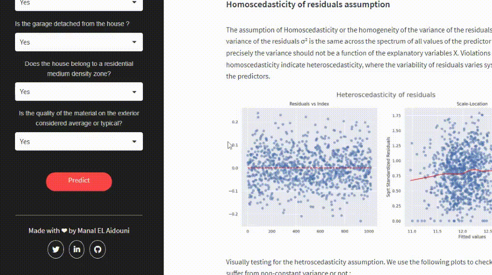

<h2 align="center">
MLR Analysis and Prediction of Ames Real Estate Prices with Streamlit

</h2>

<br>


This interactive app enables you to predict the price of your dream house in the real estate market of Ames, Iowa. Using the user-friendly sidebar prompts on the left, you can input various features and get an estimated house price based on multiple linear regression.

<br>

<p align = "center"></p>

<br>

On the right-hand side, you'll find a blog-style write-up that provides a detailed explanation of the analysis and modeling workflow including running statistical multiple linear regression (MLR) analysis on the Ames dataset where we thoroughly examine MLR assumptions and conduct residuals analysis.  

We also explore the geo location data of the houses, which were resourcefully assembled, to uncover further trends and patterns.

<br>

<p align = "center"></p>

<br>

Furthermore, we explain the thought-out process of feature selection including the use of AIC (Akaike Information Criterion), BIC (Bayesian Information Criterion), adjusted R² and RMSE (Root Mean Squared Error) metrics, as well as advanced Machine Learning modeling with Stacking ensemble followed by model interpretation using SHAP. 

You can access the deployed web app on Streamlit Community Cloud at this [link ](https://ames-real-estate.streamlit.app/) 🌐.

<br>

For further details on the mentioned steps and more, as well as re-running conducted experiments, you can refer to the accompanying notebook which  provides more information than the write-up in the Streamlit app. You can directly run the notebook in your browser by clicking on the Colab badge, or you can read it using the NBViewer badge:


<br>


<p align="center">
    <a href="https://colab.research.google.com/github/Manalelaidouni/Blog-jupyter-notebooks-/blob/master/Analysis_and_modeling.ipynb" target="_parent\"></a>     
    <a href="https://nbviewer.org/github/Manalelaidouni/Blog-jupyter-notebooks-/blob/master/Analysis_and_modeling.ipynb" target="_parent\"></a> 


</p>


<br>

## Installation ⚒️


1. Clone this repo

    ```
    git clone https://github.com/Manalelaidouni/MLR-Ames.git
    ```

1. Change into the `MLR-Ames` directory

    ```
    cd MLR-Ames
    ```

1. Create and activate a virtual environment, you can name it what you want, I called mine `streamlit_env`
    ```
    conda create --name streamlit_test_env python=3.7.9

    conda activate streamlit_test_env

    pip install -r  requirements.txt
    ```

4. Activate Streamlit and run `app.py`
    ```
    streamlit run app.py
    ```


5. Running the above command should result in you seeing the following:

    ```
    You can now view your Streamlit app in your browser.

    Local URL: http://localhost:8501
    Network URL: http://192.168.8.105:8501
    ```

<br>


## Contact 🤝


Feel free to reach out if you have any questions or feedback!

- Reach out on [Twitter](https://twitter.com/Manal_ELAI).
- Send me an [email](mailto:mm.elaidouni@gmail.com).
- Connect with me on [LinkedIn](https://www.linkedin.com/).
- Check out my [Blog](https://manalelaidouni.github.io/).

